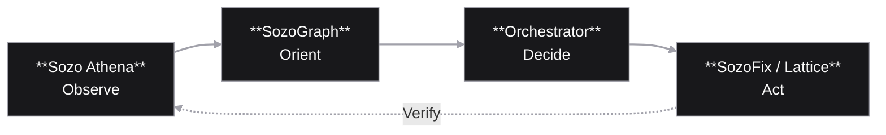

# Sozo Analytics Lab

> We are at a transition point in computing.  
> We are moving from tools that calculate to partners that understand.

At **Sozo Analytics Lab**, we are building the infrastructure for that transition.

We believe intelligence without context is a novelty, and agency without memory is a toy. The systems we build are designed to be coherent, persistent, and grounded in the physical world.

Human progress has always depended on quiet competence. Civilizations endure because people observe carefully, reason deeply, and repair what breaks. Knowledge passes hand to hand, systems evolve, and tools become extensions of human capability.

Our work aims to amplify that instinct.

We unify **perception, memory, reasoning, and action** into systems that do not merely respond to prompts but develop durable understanding.

---

# The Perception Stack

We do not think of intelligence as isolated features.

We design integrated systems that allow machines to **observe, orient, decide, and act** in the real world.

---

## [SozoGraph](https://github.com/Sozo-Analytics-Lab/sozograph) — The Memory

Most AI systems have the memory of a goldfish. They retrieve text but do not maintain belief.

**SozoGraph** is our memory architecture: a *Cognitive Passport* that converts interaction history into structured state. Instead of fragmented conversations, agents maintain coherent models of users, environments, and tasks.

Memory becomes persistent, private, and portable.

---

## [Sozo Athena](https://sozo-athena-186891137448.us-west1.run.app) — The Perception Engine

Understanding the physical world requires more than object detection.

**Sozo Athena** analyzes visual input and synthesizes layered understanding: scientific context, engineering structure, and operational behavior. From a single capture, Athena generates the conceptual and mechanical model required to understand how an object works.

Perception becomes comprehension.

---

## [SozoFix](https://sozofix.tech) — The Physical Interface

Repair is one of humanity's oldest technologies.

**SozoFix** bridges the gap between a broken object and a functional one. By combining visual diagnosis with guided repair workflows, it makes repair as intuitive as replacement.

Every repair becomes both an outcome and a data point, gradually building the shared intelligence required to make repair scalable.

---

## [Sozo Lattice](https://github.com/Sozo-Analytics-Lab/Sozo-Lattice) — The Material Layer

Durability begins at the material level.

**Sozo Lattice** applies computational modeling to material behavior, allowing designers and engineers to understand how structures degrade and how they can be made more resilient.

Where SozoFix focuses on repair, Lattice focuses on prevention.

---

## [Sozo Pitch Helper](https://pitchhelper.netlify.app) — The Behavioral Mirror

Human performance is also a system.

**Sozo Pitch Helper** measures communication clarity, composure, and audience comprehension during high-stakes presentations. By transforming subjective feedback into structured insight, it allows individuals to refine their thinking and delivery through data.

---

# Engineering Philosophy

We are not interested in building clever demos.

We build systems that endure.

"You can’t connect the dots looking forward; you can only connect them looking backwards."

Instead of isolated features, we engineer systems that function together. Memory, perception, and action operate as a continuous loop of understanding and improvement.

---

## The Craft of Certainty

We treat AI output as untrusted code.

By combining probabilistic models with symbolic reasoning and physics-based validation, we replace guesswork with verification. Our goal is not for machines to speculate, but to know.

---

## The Rhythm of Agency

True intelligence is cyclical.

Systems must **observe, orient, decide, and act**, continuously refining their understanding through interaction with the world.

---

## Elegant Efficiency

Constraints sharpen design.

Our architecture prioritizes clarity and minimalism, ensuring that systems remain understandable, maintainable, and reliable as they evolve.

---

## The Long Now

We build systems designed to mature over years.

Civilization advances through accumulated knowledge, shared practice, and durable tools. Our aim is to create software that participates in that same long arc of progress.

---

# The Work

Sozo Analytics Lab operates at the intersection of **artificial intelligence and physical utility**.

We are not simply building applications.

We are engineering systems that extend human capability and preserve the knowledge required to sustain the world we inhabit.

Explore our repositories and experiments to see what we are building.

📩 [rairo@sozofix.tech](mailto:rairo@sozofix.tech)
